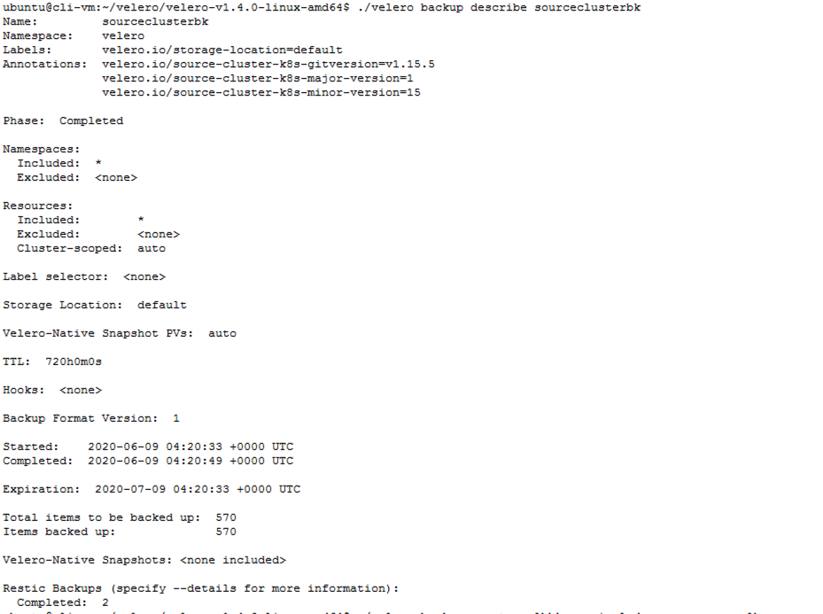
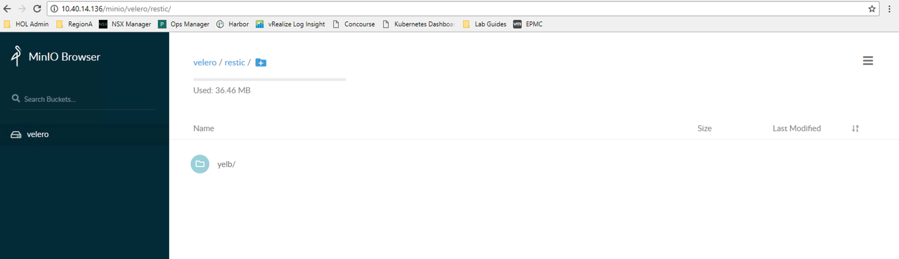
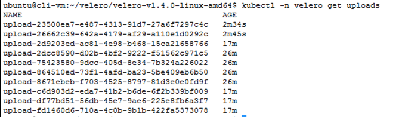
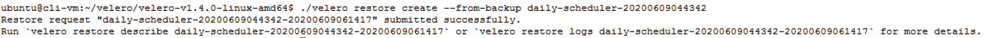

VMware Advanced Customer Engagements (ACE) Team

July 020

Table of Contents
=================

[Introduction 3](#introduction)

[Recoverability in Kubernetes 3](#recoverability-in-kubernetes)

[Velero 3](#velero)

[Velero vSphere plugin 6](#velero-vsphere-plugin)

[Use-case 6](#use-case)

[Assumptions 8](#assumptions)

[Minio 9](#minio)

[Setup Minio 9](#setup-minio)

[Minio Cleanup 15](#minio-cleanup)

[Velero 16](#velero-1)

[Velero Setup 16](#velero-setup)

[Install Velero 17](#install-velero)

[Uninstall Velero 24](#uninstall-velero)

[Yelb Application 25](#yelb-application)

[Deploy Yelb 25](#deploy-yelb)

[Unistall Yelb 29](#unistall-yelb)

[On-demand Backups 30](#on-demand-backups)

[Cluster Backup Using the Restic Plugin 36](#cluster-backup-using-the-restic-plugin)

[Cluster Backup Using the vSphere plugin 40](#cluster-backup-using-the-vsphere-plugin)

[Namespace Backup Using the Restic Plugin 46](#namespace-backup-using-the-restic-plugin)

[Namespace Backup Using the vSphere plugin 48](#namespace-backup-using-the-vsphere-plugin)

[Scheduled Backups 51](#scheduled-backups)

[Schedule Backup Using the Restic Plugin 51](#schedule-backup-using-the-restic-plugin)

[Schedule Backup Using the vSphere plugin 52](#schedule-backup-using-the-vsphere-plugin)

[Restore Backups 56](#restore-backups)

[Restore Namespace Backup 59](#restore-namespace-backup)

[Restore Cluster Backup 61](#restore-cluster-backup)

[Restore a Point in Time Backup (Scheduled Backup) 64](#restore-a-point-in-time-backup-scheduled-backup)

[Cleanup 69](#cleanup)

[Conclusion 70](#conclusion)

Introduction
============

This document is a quick start guide for backing up a Tanzu Kubernetes
Grid Integrated (TKGI, formerly known as Enterprise PKS) Kubernetes
cluster and restoring it. This document will provide details on Valero
backup software, installing Velero, backing up an existing cluster, and
restoring to the same or another target cluster. The cluster backup will
include all Kubernetes (K8) resources as well as persistent volumes.

Recoverability in Kubernetes 
============================

Kubernetes is a portable, extensible, open-source platform for managing
containerized workloads and services at scale and provides high
availability that is declarative configuration and automation. 

While Kuberentes provides high availability and zero downtime
deployments, it does not provide data protection or migration solutions.
We need to have a backup and recovery strategy that accounts for:

-   Human errors.

-   Bugs or vulnerable systems

-   Natural disasters

-   Legal Requirements for data retention

-   Ability to migrate workloads from one cluster to another

    -   To deal with changes with providers

    -   Cost advantages

    -   Compliance with standards.

-   Ability to Archive data

We need to have a backup and recovery strategy that will help with the
recoverability of Kubernetes. In this guide we will use Velero as the
tool but there are several tools available that can be used to
accomplish the same objective,

Velero
======

Running on Kubernetes clusters or on VMs, Velero gives you tools to back
up and restore your Kubernetes cluster resources and persistent volumes.
You can run Velero in Kubernetes clusters in a public cloud or
on-premises. Velero lets you:

-   Take backups of your cluster and restore in case of loss.

-   Migrate cluster resources to other clusters.

-   Replicate your production cluster to development and test clusters.

Velero consists of:

-   A server that runs on your cluster

-   A command-line client that runs locally

**Disaster Recovery**

If you periodically back up your cluster\'s resources, you can return to
a previous state in case of some unexpected mishap, such as a service
outage. 

**Cluster Migration**

Velero can help you port your resources from one cluster to another, if
you point each Velero instance to the same cloud object storage
location. 

**Backup Reference**

It is possible to exclude individual items from being backed up, even if
they match the resource/namespace/label selectors defined in the backup
spec.

**Restore Reference**

Velero can restore resources into a different namespace than the one
they were backed up from.

**How it Works**

**On-demand backups**

-   Uploads a tar ball of copied Kubernetes objects into cloud object
    storage.

-   Calls the cloud provider API to make disk snapshots of persistent
    volumes, if specified.

**Scheduled backups**

-   The **schedule** operation allows you to back up your data at
    recurring intervals

**Restores**

The **restore** operation allows you to restore all the objects and
persistent volumes from a previously created backup. You can also
restore only a filtered subset of objects and persistent volumes.

**Backup workflow**

When you run Velero backup,

-   The Velero client makes a call to the Kubernetes API server to
    create a Backup object.

-   The BackupController notices the new Backup object and performs
    validation.

-   The BackupController begins the backup process. It collects the data
    to back up by querying the API server for resources.

The BackupController makes a call to the object storage service \-- for
example, AWS (Amazon Web Services) S3 \-- to upload the backup.

By default, Velero backup create makes disk snapshots of any persistent
volumes. You can adjust the snapshots by specifying additional flags.
Run Velero backup create \--help to see available flags. Snapshots can
be disabled with the option \--snapshot-volumes=false.

You can run Velero in Kubernetes clusters deployed in a public cloud
provider or on-premises. For detailed information, see [Compatible
Storage Providers](https://velero.io/docs/v1.0.0/support-matrix/). Each
Velero operation \-- on-demand backup, scheduled backup, restore \-- is
a custom resource, defined with a Kubernetes [Custom Resource Definition
(CRD)](https://kubernetes.io/docs/concepts/api-extension/custom-resources/#customresourcedefinitions) and
stored in [etcd](https://github.com/coreos/etcd). Velero also includes
controllers that process the custom resources to perform backup,
restore, and all related operations. You can back up or restore all
objects in your cluster, or you can filter objects by type, namespace,
and/or label.

Restic inherently is a file-based backup. Currently, on a vSphere
environment Velero uses Restic to backup Kubernetes Persistent Volumes
(PV's) by taking the backup of all the files.

For more information go to <https://velero.io/docs/master/restic/>

Velero vSphere plugin
=====================

The Velero vSphere plugin enables Velero to take a crash-consistent
VMware vSphere Storage APIs snapshot backup of a block Persistent Volume
on vSphere storage, and store the backup on S3 compatible storage.

Use-case 
========

**Stateless Applications** : these applications  do not store data or
application state to
the [cluster](https://cloud.google.com/kubernetes-engine/docs/how-to/creating-a-container-cluster) or
to persistent storage. Instead, data and application state stay with the
client, which makes stateless applications more scalable. Those types of
applications constitute about 70% of workloads deployed to Kubernetes
today, E.g. Front-end applications.

**Stateful Applications**: these applications, for example databases,
save data between sessions and require persistent storage to store the
data. The retained data is called the application\'s state. You can
later retrieve the data and use it in the next session. Kubernetes
offers persistent volumes as objects capable of retaining their state
and data. In the vSphere environment, the persistent volume objects are
backed by virtual disks that reside on a datastore.

This section defines the common use cases where Velero would be
applicable.

**Cluster Migration**: Migrate both stateful and stateless applications
from one cluster to another

**Disaster Recovery**: Restore applications (both stateful and
stateless) to a cluster from a backup in time (scheduled backup)

 Assumptions
===========

The following assumptions are made in the guide:

-   TKGI is deployed

-   The infrastructure team has setup 3 K8s clusters, the source cluster
    (where Velero backup is made from) , the target (where the Velero
    backup is restored to) cluster and an infra cluster where all
    infrastructure applications like Minio and Prometheus will be
    running .

NOTE: This is not a fixed rule, Minio can run on any cluster,
including the source and the target cluster, it could also be run on a
standalone vm. For more information on Minio visit
[*https://docs.min.io/*](https://docs.min.io/)

-   The Minio backup endpoint is accessible from both the source and target clusters.

-   A Linux/ubuntu machine is provisioned to install and use various software components

-   The provisioned Linux/ubuntu machine meets the following

    -   Can access all the 3 K8s clusters defined above

    -   Has the appropriate kubectl cli installed

    -   Has the appropriate pks cli installed

    -   Has the latest version of
        [Helm](https://github.com/helm/helm/releases) installed?

-   In this document, we will be using ci-cluster as our source cluster and my-cluster as our target cluster.

Minio
=====

Setup Minio
-----------

We will be setting up an open source version of Minio in the
infrastructure cluster. We will be using the VMware Bitnami official
opensource Minio Helm chart for K8s. The steps below describe how to
setup Minio in a K8 cluster using the Bitnami distribution.

**Step 1:** ssh to the provisioned ubuntu vm (clivm)

**Step 2:** Get kube config for the infra cluster

> pks login -a <pks api> -u <user> -p <password> -k
> pks get-credentials <cluster> 

Alternatively
> pks get-kubeconfig <cluster> -a <pks api> -u <user> -p <password> -k
>
> E.g.
>
> pks login -a pks.corp.local -u riaz -p VMware1! -k
>
> pks get-credentials infra-cluster
>
> Alternatively
>
> pks get-kubeconfig infra-cluster -a pks.corp.local -u riaz -p VMware1! -k

**Step 3:** Create as namespace to which Minio can be deployed

> kubectl create ns minio

**Step 4:** Add Bitnami Helm repository

> helm repo add bitnami <https://charts.bitnami.com/bitnami>

> helm repo update

**Step 5:** Minio requires a backing store / K8s persistent volume.
Create a storage-class on the infra cluster with the following storage
class definition. Copy the contents of the file below to a file
storage-class.yaml and create the storage class.

> \-\--
>
> kind: StorageClass
> apiVersion: storage.k8s.io/v1
> metadata:
> name: minio-disk
> provisioner: kubernetes.io/vsphere-volume
> parameters:
>   diskformat: thin

NOTE: If setting up the storage class using the CSI driver , follow the
steps provided in the VMware Tanzu documentation to set up the CSI
driver on the cluster you before creating the storage class.
<https://docs.pivotal.io/pks/1-7/vsphere-cns.html>

Storage class definition when using a CSI driver

> \-\--
>
> apiVersion: storage.k8s.io/v1
> kind: StorageClass
> metadata:
>   name: minio-disk
>   annotations:
>
> storageclass.kubernetes.io/is-default-class: \"true\"
>
> provisioner: csi.vsphere.vmware.com
>
> parameters:
>
> datastoreurl: "ds:///vmfs/volumes/5cef81a9-a9328547-8d05-00505601dfda/\"
>
Datastore url can be obtained from vCenter

> kubectl apply -f storage-class.yaml

**Step 6:** Deploy the Bitnami Minio release. This will create the necessary resources to run Minio within the minio namespace

> helm install minio-release -n minio --set accessKey.password=minio --set secretKey.password=minio123 --set persistence.storageClass=minio-disk --set persistence.size=128Gi bitnami/minio

NOTE: When sizing the storage for Minio, make sure there is about 3X
times the storage the reason for which is minio stages the backup before
commit. E.g. if a backup takes about 10Gi we would require about 30Gi ,.
The extra storage is for the restore , velero uploads restore data to
mino which also requires space.

**Step 7:** Check for all pods, deployments and services and make sure
everything is created and the pods are running as expected. Also check
if the PVC is created and bound

> kubectl get all -n minio

> kubectl get pvc -n minio

> kubectl get deployment -n minio

**Step 8:** Expose the deployment as a Load Balancer. This will create a
lb within NSX-T as well as an ingress.

> kubectl expose deployment minio-release --name=minio-frontend-lb --port=80 --target-port=9000 --type=LoadBalancer --namespace=minio

**Step 9:** Check the IP under the "External-IP" section, point your browser to that IP address:port . The Minio application should be accessible

**Step 10:** Login with the credentials used in step 6. E.g.
minio/minio123

**Step 11:** Create a bucket called Velero. We will be using this bucket
when we install Velero to the clusters in the following steps:

Minio Cleanup
-------------

To clean up Minio, uninstall the deployed helm release

helm ininstall minio-release -n minio

Velero
======

This section goes through the steps to download Velero to the
provisioned Ubuntu vm (cli vm) and install it on both the source and
target clusters.

Velero Setup
------------

**Step 1:** Navigate to the official page of Velero
(<https://github.com/vmware-tanzu/velero/releases>) and copy the link
for the target VM (Virtual Machine) OS (operating systems). (Eg.
<https://github.com/vmware-tanzu/velero/releases/tag/v1.4.0>). At the
bottom of the page the official releases are listed, Right clink on the
release link 'Copy Link address'

**Step 2:** ssh to the provisioned ubuntu vm. (clivm)

**Step 3**: Download and uncompress the Velero distribution

> mkdir velero

> cd \~/velero

> wget <https://github.com/vmware-tanzu/velero/releases/download/v1.4.0/velero-v1.4.0-linux-amd64.tar.gz>

> tar xvf velero-v1.4.0-linux-amd64.tar.gz

Install Velero
--------------

This section describes the steps required to install Velero to both the
source and target clusters. Any cluster from which a backup is taken or
to which a backup is restored requires to have Velero deployed to it.

**Source Cluster**

Source cluster is the cluster from which a Velero backup will be taken
from**.** As mentioned in the assumptions section we will be using the
ci-cluster as our source cluster.

**Step 1:** ssh into the provisioned linux/ubuntu vm (clivm)

**Step 2:** Get kube config for the source cluster:

> pks login -a <pks api> -u <user> -p <password> -k
> pks get-credentials <cluster> 

Alternatively 
> pks get-kubeconfig \<source-cluster\> -a \<pks api\> -u \<user\> -p
\<password\> -k

> E.g.
> pks login -a pks.corp.local -u riaz -p VMware1! -k
> pks get-credentials ci-cluster
Alternatively
> pks get-kubeconfig ci-cluster -a pks.corp.local -u riaz -p VMware1! -k

**Step 3:** Create a namespace for Velero, called velero:

> kubectl create ns velero

**Step 4:** Change directory to the velero directory:

> cd \~/velero/velero-v1.4.0-linux-amd64

**Step 5:** Create a credentials file, and name it credentials. This
will contain the username and password used for Minio. The values would
be the same as what was provided during the Minio setup.

> \[default\]
> aws\_access\_key\_id = minio
> aws\_secret\_access\_key = minio123

Note: This file can be deleted once the Velero is installed to the
cluster.

**Step 6:** Set kubectl context to the source cluster

kubectl config use-context \<source-cluster\>

> E.g.\
> kubectl config use-context ci-cluster

**Step 7:** Install Velero to the source cluster.

> ./velero install \\
>
> \--provider aws \\
>
> \--bucket velero \\
>
> \--secret-file ./credentials \\
>
> \--use-restic \\
>
> \--backup-location-config
> region=minio,s3ForcePathStyle=\"true\",s3Url=http://\<external-ip of
> minio\>;\<port\> \\
>
> \--snapshot-location-config region=minio \\
>
> \--plugins velero/velero-plugin-for-aws:v1.1.0

Note: The secrets file points to location of the file credentials file
we created above

use Restic to backup pv's the s3Url points to the Minio that was setup
earlier.

E.g.

> ./velero install \\
>
> \--provider aws \\
>
> \--bucket velero \\
>
> \--secret-file ./credentials \\
>
> \--use-restic \\
>
> \--backup-location-config
> region=minio,s3ForcePathStyle=\"true\",s3Url=http://10.40.14.66 \\
>
> \--snapshot-location-config region=minio \\
>
> \--plugins velero/velero-plugin-for-aws:v1.1.0

**Step 8:** Get status of pods in the velero namespace

> kubectl get po -n velero

**Step 9:** If the Restic pods fails to startup, we will need to edit
the hostPath for the Restic pods.

> kubectl edit daemonset restic -n velero

change hostPath from /var/lib/kubelet/pods to
> /var/vcap/data/kubelet/pods:

Which will look like below

> -hostPath:
>    path: /var/vcap/data/kubelet/pods

**Step 10:** Get all the plugins in velero

> ./velero plugin get

Note: The AWS and restic plugins installed in the previous step is
listed.

Step 11:** Install the Velero Plugin for vSphere. This plugin is an
alternate to Restic and enables Velero to take crash-consistent snapshot
backup of a block Persistent Volume on vSphere storage and backup of
volume data into S3 compatible storage. The Velero vSphere plugin has a
few prerequisites:

-   Velero - Version 1.3.2 or above

-   vSphere - Version 6.7U3 or above

-   vSphere CSI/CNS driver 1.0.2 or above

-   Kubernetes 1.14 or above (note: the Velero Plug-in for vSphere does
    not support Guest or Supervisor clusters on vSphere yet)

Make sure these are met before you proceed to the next step

**Step 12:** Install the vSphere CSI driver . Follow the steps provided
in the VMware Tanzu documentation to set up the CSI driver on the
cluster you before creating the storage class.
<https://docs.pivotal.io/pks/1-7/vsphere-cns.html>

NOTE: Make sure that the csi-vsphere.conf file has the correct values

>\[Global\]
>
> cluster-id = \<cluster-name\>
>
> \[VirtualCenter \"\<vcenter-ip\>\"\]
>
> insecure-flag = \"true\"
>
> user = \"\<vcenter-username\>\"
>
> password = \"vcenter-password\>"
>
> port = \"443\"
>
> datacenters = \"\<vcenter-datacenter\>\"
>
> Eg.
>
> \[Global\]
>
> cluster-id = ci-cluster
>
> \[VirtualCenter \"192.168.110.22\"\]
>
> insecure-flag = \"true\"
>
> user = \"administrator\@corp.local\"
>
> password = \"VMware1!\"
>
> port = \"443\"
>
> datacenters = \"RegionA01\"

**Step 13:** Install the velero vsphere plugin

> ./velero plugin add vsphereveleroplugin/velero-plugin-for-vsphere:1.0.1

**Step 14:** Verify if the velero vsphere plugin has been installed

> ./velero plugin get

**Note :** The vsphere plugin is listed along with AWS and restic.

**Target Cluster**

A target cluster is the cluster to which a Velero backup is to be
restored**.** As mentioned in the assumptions section we will be using
'my-cluster' as our source cluster

**Step 1:** ssh into the provisioned linux/ubuntu vm (clivm)

**Step 2:** Get kube config for the target cluster

> pks login -a <pks api> -u <user> -p <password> -k
> pks get-credentials <cluster> 

Alternatively
> pks get-kubeconfig <cluster> -a <pks api> -u <user> -p <password> -k
> E.g.
> pks login -a pks.corp.local -u riaz -p VMware1! -k
> pks get-credentials my-cluster
> Alternatively
> pks get-kubeconfig my-cluster -a pks.corp.local -u riaz -p VMware1! -k

**Step 3: Follow steps 3 to 14 in the previous section.**

Uninstall Velero
----------------

To uninstall Velero we will need to delete all the resources associated
with its install

> kubectl delete namespace/velero clusterrolebinding/velero

> kubectl delete crds -l component=velero

Yelb Application 
================

In this section we will be deploying the Yelb
(<https://github.com/mreferre/yelb>) application to the source cluster.
Yelb allows users to vote on a set of alternatives (restaurants) and
dynamically updates pie charts based on number of votes received.

The Yelb application will help us validate stateful pods and persistent
data is being backed up by Velero and the Velero restore operation keeps
the state of the data intact.

Deploy Yelb 
-----------

**Step 1:** Get kube config for the source cluster

> pks login -a <pks api> -u <user> -p <password> -k
> pks get-credentials <cluster>
>
> Alternatively
> pks get-kubeconfig <cluster> -a <pks api> -u <user> -p <password> -k
> E.g.
> pks login -a pks.corp.local -u riaz -p VMware1! -k
> pks get-credentials ci-cluster
> pks get-kubeconfig ci-cluster -a pks.corp.local -u riaz -p VMware1! -k

**Step 2:** Set kubectl context to the source cluster

> kubectl config use-context \<source-cluster\>

> E.g.\
> kubectl config use-context ci-cluster

**Step 3**: Yelb requires a backing store / K8s persistent volume.
Create a storage-class on the infra cluster with the following storage
class definition. Copy the contents of the file below to a file
storage-class.yaml and create the storage class.

> \-\--
>
> kind: StorageClass
>
> apiVersion: storage.k8s.io/v1
>
> metadata:
>
> name: thin-disk
>
> annotations:
>
> storageclass.kubernetes.io/is-default-class: \"true\"

provisioner: kubernetes.io/vsphere-volume

> parameters:
>
> diskformat: thin

NOTE: If setting up the storage class using the csi driver , follow the
steps provided in the VMware Tanzu documentation to set up the CSI
driver on the cluster you before creating the storage class.
<https://docs.pivotal.io/pks/1-7/vsphere-cns.html>

Storage class definition when using a CSI driver

> \-\--
>
> apiVersion: storage.k8s.io/v1
>
> kind: StorageClass
>
> metadata:
>
> name: csi-sc
>
> annotations:
>
> storageclass.kubernetes.io/is-default-class: \"true\"
>
> provisioner: csi.vsphere.vmware.com
>
> parameters:
>
> datastoreurl:
> \"ds:///vmfs/volumes/5cef81a9-a9328547-8d05-00505601dfda/\"
>
Datastore url can be obtained from vcenter

> kubectl apply -f storage-class.yaml

**Step 3**: Create a yelb namespace

> kubectl create ns yelb

**Step 4:** Create the persistent volume claims required for this
application. This will create a PVC for the redis-server and the yelb-db
database.

Copy the contents of the file
<https://github.com/riazvm/velerobackupandrestore/blob/master/application/yelb/yelb-pvc.yaml>

to a local file for e.g. yelb-pvc.yaml

> kubectl apply -f yelb-pvc.yaml

**Step 5:** Deploy the Yelb application, this will create the necessary
deployments, pods and services and expose the yelb-ui deployment as an
ingress of type loadbalancer

Copy the contents of the file
<https://github.com/riazvm/velerobackupandrestore/blob/master/application/yelb/yelb.yaml>

file to a local file for e.g. yelb.yaml

> kubectl apply -f yelb.yaml

**Step 6:** Verify if all the pods are running on the yelb name
namespace

> kubectl get po -n yelb \--watch

**Step 7:** Get the loadbalancer ip for the ingress to access the Yelb
application. The EXTERNAL-IP is the loadbalancer's ip.

> kubectl get svc -n yelb

**Step 8:** Access the application by pointing the browser to the ip
from the previous step

Unistall Yelb 
-------------

To delete the Yelb application and all its associated resources, delete
the yelb namespace

> kubectl delete ns yelb

On-demand Backups 
=================

This section describes steps to backup resources deployed to a source
cluster. Before backing up an application , namespace, or a cluster
there are a few considerations to take into account

-   Schedule a downtime before taking a backup, this would help with
    data consistency for stateful applications

-   For stateless applications built on the 12-factor principles and if
    application require to be highly available, consider having a global
    load balancer to route traffic to an active-active cluster and block
    traffic to the source cluster.

-   Consider how pod to pod routing of services is designed, if a
    service mesh is being considered in the design as well

-   For stateless applications built on the 12-factor principles check
    if a backup is necessary or if the application can be deployed to
    the target cluster with a pipeline in place

-   Consider application retry mechanisms in place for events , message
    bus etc.

The steps give an overview of backing up all the resources in a cluster
as well as backing up just a namespace in a cluster. This document does
not go through the steps required to be considered before backing up a
cluster.

The typical uses cases to perform a K8s resource backup is to facilitate
application migrations from one cluster to another or between namespaces
etc.

**Step 1:** Get kube config for the source cluster

> pks login -a <pks api> -u <user> -p <password> -k
> pks get-credentials <cluster>
>
> Alternatively
> pks get-kubeconfig <cluster> -a <pks api> -u <user> -p <password> -k
> E.g.
> pks login -a pks.corp.local -u riaz -p VMware1! -k
> pks get-credentials ci-cluster
> pks get-kubeconfig ci-cluster -a pks.corp.local -u riaz -p VMware1! -k

**Step 2:** Set kubectl context to the source cluster

> kubectl config use-context \<source-cluster\>

> E.g.\
> kubectl config use-context ci-cluster

**Step 3:** Check all resources running on the source cluster

kubectl get ns

NOTE: apart from the default and system namespaces, yelb, x1, y1 and z1
exist

> kubectl get po \--all-namespaces

NOTE: Note the pods running in the yelb , x1, y1 and z1 namespaces

> kubectl get pv \--all-namespaces

NOTE: There are a couple of PVs in the yelb namespace (redis and yelb
database)

**Step 4:** Login to the Yelb application and make sure that the
application is reachable

> kubectl get svc -n yelb

Point the browser to the external-ip of yelb-ui service

**Step 5:** The Yelb application runs a yelb-db and the redis-server
pods which are both stateful. All stateful pods need to be annotated.

NOTE: when using the velero vsphere plugin annotation is not required
(Skip Step 5, Step 6 and Step 7)

Run the following to annotate each pod that contains a volume to back up

> kubectl -n YOUR\_POD\_NAMESPACE annotate pod/YOUR\_POD\_NAME
> backup.velero.io/backup-volumes=YOUR\_VOLUME\_NAME\_1,YOUR\_VOLUME\_NAME\_2,\...

**Step 6:** To find the volumes for the stateful pod, identify the
stateful pod and describe it. For eg. in the Yelb deployment is the
stateful pod

> kubectl get po -n yelb

The yelb application has two stateful pods (yelb-db and the
redis-server)

> kubectl describe po yelb-db-0 -n yelb

The volumes associated with this pod is

>Volumes:
>
>**mysql-persistent-storage:**
>
>Type: PersistentVolumeClaim (a reference to a PersistentVolumeClaim in
>the same namespace)
>    ClaimName: db-pv-claim
>   ReadOnly: false

> kubectl describe po redis-server-0 -n yelb

The volumes associated with this pod is

> Volumes:
>
> **redis-persistent-storage:**
>
> Type: PersistentVolumeClaim (a reference to a PersistentVolumeClaim in
> the same namespace)
>
> ClaimName: redis-pv-claim
>
> ReadOnly: false

**Step 7:** Annotate the yelb-db-0 and redis-server-0 pods

> kubectl -n yelb annotate pod/\< yelb db name for eg. yelb-db-0 \>
> backup.velero.io/backup-volumes=\<volume name\>
>
> e.g.
>
> kubectl -n yelb annotate pod/yelb-db-0
> backup.velero.io/backup-volumes=mysql-persistent-storage
>
> kubectl -n yelb annotate pod/redis-server-0
> backup.velero.io/backup-volumes=redis-persistent-storage

**Step 8:** Login to the Yelb application and vote for some of the
restaurants listed. The voting data is persisted in the Yelb database,
this data will validate the state of the application when restored. Keep
a tab on the votes.

Cluster Backup Using the Restic Plugin
--------------------------------------

**Step 9:** Create a backup all the resources in a cluster

> cd \~/velero/velero-v1.4.0-linux-amd64
>
> ./velero create backup \<BACKUP NAME\>
>
> E.g.
>
> ./velero create backup sourceclusterbk

**Step 10:** Check status of the backup. The output describes the status
of the backup. We have taken a complete backup and hence all resources
and PVs are backed up.

> ./velero backup describe \<BACKUP NAME\>
>
>**E.g.**
>
>./velero backup describe sourceclusterbk

Note: The restic backups -- these are backups of the pv's in this case
the yelb-db and redis server

**Step 11:** Login to Minio and check if the backup and restic folders
have been created. Use http://\<minio-service-external-ip\>, e.g.
<http://10.40.14.136>.

To find the ip of minio check the IP under the "External-IP" section,
point your browser to the location \<external-ip\>. The Minio
application should be accessible

> kubectl get svc -n minio

The backup folder contains the resource backup's and the restic contains
the persistent volume backup's, the pv backups are referenced within the
backup.

**Step 12:** Login to the Yelb application and more votes to the
restaurants listed. The voting data is persisted in the Yelb database,
this data will validate the state of the application when restored.

Cluster Backup Using the vSphere plugin
---------------------------------------

**Step 1:** Create a Volume snapshot location. This Volume Snapshot
location is referenced when a backup is taken

> cd \~/velero/velero-v1.4.0-linux-amd64

> ./velero snapshot-location create vsphere-snap-loc \--provider
velero.io/vsphere

**Step 2:** Create a cluster backup

> ./velero backup create srccluster-snap-backup \--snapshot-volumes
> \--volume-snapshot-locations vsphere-snap-loc

**Step 3:** Check status of the backup. The output describes the status
of the backup. We have taken a complete backup and hence all resources
and PVs are backed up.

> ./velero backup describe \<BACKUP NAME\>
>
> For more details on the backup
>
> ./velero backup describe \<BACKUP NAME\> \--details
>
>**E.g.**
>
> ./velero backup describe srccluster-snap-backup

NOTE: Event if the velero backup status shows complete the backup would
not have been complete. When the vsphere plugin is used there is a lot
of operations that happen in the background. During the backup there are
a number of operations that occur in Vsphere.

**Step 4:** Monitor the uploads

> kubectl -n velero get uploads

NOTE: Until the uploads are complete do not perform a restore operation

**Step 5:** Login to Minio and check if the backup and plugins folders
have been created.

To find the ip of minio check the IP under the "External-IP" section,
point your browser to the location \<external-ip\>. The Minio
application should be accessible

> kubectl get svc -n minio

**Step 6:** Login to the Yelb application and more votes to the
restaurants listed. The voting data is persisted in the Yelb database,
this data will validate the state of the application when restored.

Namespace Backup Using the Restic Plugin
----------------------------------------

**Step 1:** Create a backup of the yelb namespace

> cd \~/velero/velero-v1.4.0-linux-amd64
>
> ./velero backup create \<BACKUP NAME\> \--include-namespaces
\<NAMESPACE1\>
>
> E.g.
>
> ./velero backup create yelbbkup \--include-namespaces yelb

**Step 2:** Check status of the backup

> ./velero backup describe yelbbkup

The backup describes the status , the resources etc. In this case as
shown , only the resources associated with namespace yelb is backed-up.
The Restic backups describe the number of PV's that have been backed up.

**Step 3:** Login to minio and check if the backup has been created.

**Step 4:** Other options for backup

> ./velero backup create planes \--selector app=yelb

Check Velero documentation <https://velero.io/docs/v1.4/> for other
options

Namespace Backup Using the vSphere plugin
-----------------------------------------

**Step 1:** Create a Volume snapshot location. This Volume Snapshot
location is referenced when a backup is taken

NOTE: If a snapshot location has already been created this step is
optional

> cd \~/velero/velero-v1.4.0-linux-amd64
>
> ./velero snapshot-location create vsphere-snap-loc \--provider velero.io/vsphere

**Step 2:** Create a namespace backup

> ./velero backup create yelb-vspheresnap-bkp \--include-namespaces=yelb
> \--snapshot-volumes \--volume-snapshot-locations vsphere-snap-loc

**Step 3:** Check status of the backup

> ./velero backup describe yelb-vspheresnap-bkp --details

NOTE: Even if the velero backup status shows 'complete', the backup
would not have been complete. When the vSphere plugin is used there is a
lot of operations that happen in the background (vSphere etc.).

**Step 4:** Monitor the uploads

kubectl -n velero get uploads

NOTE: Until the uploads are complete do not perform a restore operation

**Step 5:** Check vCenter to make sure that none of the operations
related to the backup are running

**Step 6:** Login to Minio and check if the backup exists

Scheduled Backups
=================

Schedule Backup Using the Restic Plugin
---------------------------------------

The schedule operation allows you to back up your data at recurring
intervals. The first backup is performed when the schedule is first
created, and subsequent backups happen at the schedule\'s specified
interval. These intervals are specified by a Cron expression.

Scheduled backups are point in time backups and can be used for disaster
recovery use cases.

**Step 1:** Login to the Yelb application and more votes to the
restaurants listed. The voting data is persisted in the Yelb database it
will validate the state of the application when restored.

**Step 2:** Create a backup scheduler

> ./velero schedule create \<scheduler-name\> \--schedule
> \<cron-expression\>
>
> E.g.
>
> To create a daily scheduler (use <https://crontab.guru/every-15-minutes>
> for cron expressions if needed)
> 
> ./velero schedule create daily-scheduler \--schedule=\"\@every 24h\"
> \--ttl 24h0m0s

Note: The TTL flag allows the user to specify the backup retention
period with the value specified in hours, minutes, and seconds in the
form \--ttl 24h0m0s. 

**Step 3:** Login to Minio and check if the backup has been created.
When creating a scheduler, the first backup will be created soon as the
schedule is submitted.

Note: The state data of the application before each backup was performed
was as below

Schedule Backup Using the vSphere plugin
----------------------------------------

**Step 1:** Login to the Yelb application and more votes to the
restaurants listed. The voting data is persisted in the Yelb database ,
this data will validate the state of the application when restored.

**Step 2:** Create a Volume snapshot location. This Volume Snapshot
location is referenced when a backup is taken

NOTE: If a snapshot location has already been created this step is
optional

> cd \~/velero/velero-v1.4.0-linux-amd64

> ./velero snapshot-location create vsphere-snap-loc \--provider velero.io/vsphere

**Step 3:** Create a backup scheduler

> ./velero schedule create \<scheduler-name\> \--schedule
> \<cron-expression\> \--snapshot-volumes \--volume-snapshot-locations
> vsphere-snap-loc
> 
> E.g.
> 
> To create a daily scheduler (use <https://crontab.guru/every-15-minutes>
> for cron eexpressions if needed)
> 
> ./velero schedule create daily-scheduler \--schedule=\"\@every 24h\"
> \--ttl 24h0m0s \--snapshot-volumes \--volume-snapshot-locations
> vsphere-snap-loc

Note: The TTL flag allows the user to specify the backup retention
period with the value specified in hours, minutes, and seconds in the
form \--ttl 24h0m0s. 

**Step 4:** Monitor the uploads

> kubectl -n velero get uploads

**Step 5:** Check vCenter to make sure that none of the operations
related to the backup are running

NOTE: Event if the velero backup status shows complete the backup would
not have been complete. When the vsphere plugin is used there is a lot
of operations that happen in the background. During the backup there are
a number of operations that occur in Vsphere.

**Step 6:** Login to Minio and check if the scheduled backup has been
created

 ---------------------------------------------------------------------------------------------
|   **Backup Type**      | **Votes**  | **Outback**  | **Buca**  | **IHop**  |  **Chipotle**  |
| ---------------------- | ---------- | ------------ | --------- | --------- | -------------- |
| Full Cluster           | 15         | 4(27%)       | 3(20%)    | 5(33%)    | 3(20%)         |
| Namespace              | 38         | 12(8%)       | 8(21%)    | 14(37%)   | 4(11%)         |
| Scheduled              | 17         | 17(36%)      | 8(17%)    | 18(38%)   | 4(8.51%)       |

Check Velero documentation <https://velero.io/docs/v1.4/> for other
options

Restore Backups
===============

This section describes steps to restore a Velero backup to a target
cluster. The steps give an overview of restoring a backup of a namespace
and an entire clusterbackup. The restore procedure is the same if using
a backup that used the restic plugin or the vsphere plugin. If the
status of the restore indicates complete it does mean the restore is
complete unlike the backup process.

**Step 1:** Get kube config for the source cluster

> pks login -a <pks api> -u <user> -p <password> -k
> pks get-credentials <cluster>
>
> Alternatively
> pks get-kubeconfig <cluster> -a <pks api> -u <user> -p <password> -k
> E.g.
> pks login -a pks.corp.local -u riaz -p VMware1! -k
> pks get-credentials my-cluster
> pks get-kubeconfig my-cluster -a pks.corp.local -u riaz -p VMware1! -k

**Step 2:** Set kubectl context to the target cluster

kubectl config use-context \<target-cluster\>

> E.g.\
> kubectl config use-context my-cluster

**Step 3:** Check all resources running on the target cluster

> kubectl get ns

NOTE: yelb, x1, y1 and z1 namespaces do not exist

**Step 4:** Before backing up to a cluster, make sure you have defined a
storage class to be used by the stateful applications that is being
restored. Create a storage-class on the target cluster with the
following storage class definition.

Copy the contents of the file below to a file storage-class.yaml and
create the storage class.

> \-\--
>
> kind: StorageClass
>
> apiVersion: storage.k8s.io/v1
>
> metadata:\
> storageclass.kubernetes.io/is-default-class: \"true\"
>
> name: thin-disk
>
> provisioner: kubernetes.io/vsphere-volume
>
> parameters:
>
> diskformat: thin

> kubectl apply -f storage-class.yaml

> kubectl get sc

NOTE: If setting up the storage class using the csi driver , follow the
steps provided in the VMware Tanzu documentation to set up the CSI
driver on the cluster you before creating the storage class.
<https://docs.pivotal.io/pks/1-7/vsphere-cns.html>

Storage class definition when using a CSI driver

> \-\--
>
> apiVersion: storage.k8s.io/v1
>
> kind: StorageClass
>
> metadata:
>
> name: csi-sc
>
> annotations:
>
> storageclass.kubernetes.io/is-default-class: \"true\"
>
> provisioner: csi.vsphere.vmware.com
>
> parameters:
>
> datastoreurl:
> \"ds:///vmfs/volumes/5cef81a9-a9328547-8d05-00505601dfda/\"

> kubectl get sc

**Step 5:** Create a Volume snapshot location. (If using the velero
vsphere plugin)

NOTE: If a snapshot location has already been created this step is
optional

> cd \~/velero/velero-v1.4.0-linux-amd64

> ./velero snapshot-location create vsphere-snap-loc \--provider
> velero.io/vsphere

Restore Namespace Backup
------------------------

**Step 6:** Restore the yelb namespace from the yelbbkup created in the
previous step.

> cd \~/velero/velero-v1.4.0-linux-amd64

> ./velero restore create \--from-backup yelbbkup

In the above example for vsphere plugin the namespace backup was named
yelb-vspheresnap-bkp

> ./velero restore create \--from-backup yelb-vspheresnap-bkp

**Step 7:** Check the status of the restore in the cluster. The yelb
namespace should be created and the pods should be up and running. Make
sure that the pv is also created and bound:

> kubectl get ns
>
> kubectl get po -n yelb
>
> kubectl get pvc -n yelb

Note: Only the yelb namespace and its resources have been restored

**Step 8:** Get the external ip of yelb-ui, point the browser to it and
make sure all the data is visible in the application, and the
application is reachable. Compare the voting data recorded in the table
before the namespace backup was taken.

kubectl get svc -n yelb

**Step** **9:** Delete the yelb namespace which will delete the
application and the PV:

> kubectl delete ns yelb

> kubectl get ns

Restore Cluster Backup
----------------------

**Step 10:** Restore the back of all resources from the source cluster
to the target cluster:

> cd \~/velero/velero-v1.4.0-linux-amd64
>
> ./velero restore create \--from-backup sourceclusterbk

In the above example for vsphere plugin the namespace backup was named
yelb-vspheresnap-bkp

> ./velero restore create \--from-backup srccluster-snap-backup

**Step 11:** Monitor the resources created in the target cluster. The
yelb , x1, y1 and z1 namespaces should be created. Pods,pv's,
deployments and services should also be created.

> kubectl get ns
>
> kubectl get po \--all-namespaces
>
> kubectl get pvc \--all-namespaces
>
> kubectl get svc \--all-namespaces

**Step 12:** Get the external ip for the yelb-ui app

> kubectl get svc -n yelb

**Step 13:** Point the browser to it and make sure all the data is
visible in the application and the application is reachable. Compare the
voting data recorded in the table before the cluster backup was taken:

**Step 14:** The x1, y1 and z1 namespaces run nginx pods with busybox.
The nginx pod running in namespace x1 is exposed as a load balancer. Get
the external ip to this pod and point the browser to access the service:

Note: With the cluster restore all resources , including namespaces,
pv's etc are restored

From a cluster backup you could selectively restore the resources that
are required to migrate as well.

Restore a Point in Time Backup (Scheduled Backup)
-------------------------------------------------

**Step** **14:** Delete the yelb, x1 , y1 and z1 namespaces which will
delete the application and the associated PV's and other resources:

> kubectl delete ns yelb

> kubectl delete ns x1

> kubectl delete ns y1

> kubectl delete ns z1

> kubectl get ns

**Step 15:** Login to Minio, and copy the name of the backup that was
created when a backup scheduler was created. Eg.
daily-scheduler-20200609044342:

**Step 15:** Restore the point in time backup to the cluster:

> cd \~/velero/velero-v1.4.0-linux-amd64

> ./velero restore create \--from-backup daily-scheduler-20200609044342

**Step 16:** Check the status of the restore:

./velero restore describe daily-scheduler-20200609044342-20200609061417

**Step 17:** Monitor the resources created in the target cluster. The
yelb , x1, y1 and z1 namespaces should be created. Pods,pv's,
deployments and services should also be created.

> kubectl get ns
>
> kubectl get po \--all-namespaces
>
> kubectl get pvc \--all-namespaces
>
> kubectl get svc \--all-namespaces

**Step 18:** Get the external ip for the yelb-ui app

> kubectl get svc -n yelb

**Step 19**: Point the browser to it,make sure all the data is visible
in the application, and the application is reachable. Compare the voting
data recorded in the table before the cluster backup was taken.

**Step 20**: The x1, y1 and z1 namespaces run nginx pods with busybox.
The nginx pod running in namespace x1 is exposed as a load balancer. Get
the external ip to this pod and point the browser to access the service.

Note: With the cluster restore all resources , including namespaces,
pv's etc are restored from a backup in time.

Cleanup
=======

**Step 1:** Get kube config for the source cluster

> pks login -a <pks api> -u <user> -p <password> -k
> pks get-credentials <cluster>
>
> Alternatively
> pks get-kubeconfig <cluster> -a <pks api> -u <user> -p <password> -k
> E.g.
> pks login -a pks.corp.local -u riaz -p VMware1! -k
> pks get-credentials ci-cluster
> pks get-kubeconfig ci-cluster -a pks.corp.local -u riaz -p VMware1! -k

**Step 2:** Set kubectl context to the source cluster

kubectl config use-context \<source-cluster\>

> E.g.\
> kubectl config use-context ci-cluster

**Step 3:** Get all backup's taken from of a specific cluster

> ./velero backup get

**Step 4:** To delete a specific backup

> ./velero backup delete \<backupname\>

> E.g.

> ./velero backup delete sourceclusterbk

**Step 4:** To delete all backups

> ./velero backup delete \--all

**Step 5:** To delete a backup schedule

> ./velero schedule delete \<schedule-name\>

Conclusion
==========

We hope this document was useful. As you try these configuration steps,
please provide any feedback or questions in the comments section for
this document on code.vmware.com. Also, do let us know if you have any
suggestions or if you would like to see guidance on other topics.
